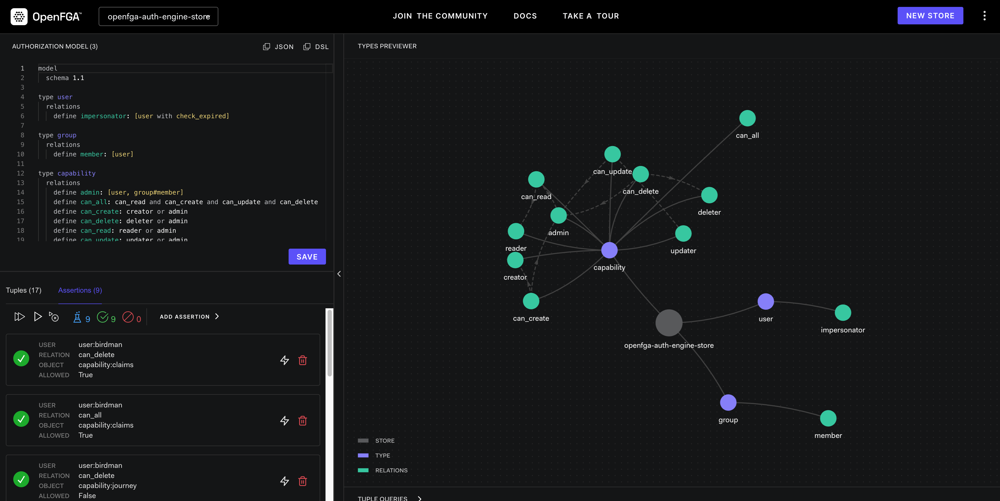

# OpenFGA based Authz Engine
## What is OpenFGA?
> [OpenFGA](https://openfga.dev/) is an open-source authorization solution that allows developers to build granular access control using an easy-to-read modeling language and friendly APIs.

This PoC hosts a webapp along that connects to an OpenFGA server and adds Authz Models, along with tuple.
It later exposes an endpoint that performs a `check` 

## How to run the POC
Use `Makefile` rules to get started
1. Run `make run` to kickstart the POC
2. Run `make stop` to bring the service down
3. Run `make clean` to cleanup all containers and images

Use the [dashboard](http://localhost:3000/playground) to view the model, tuples and assertions

## TODO
- ~~Add the Impersonator tuple (with CEL condition)programmatically~~ Done
- ~~Expose a Postman collection to do so.~~ Done
- Create a POST to accept tuples to create
- Create a POST /check that accepts json to check if an impersonation is valid and has the correct permissions to perform a CRUD.