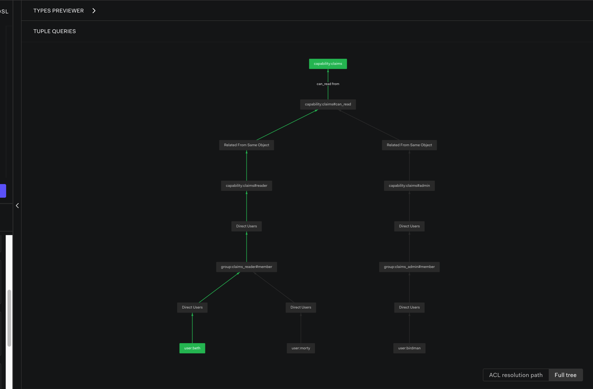

# OpenFGA based Authz Engine
## What is OpenFGA?
> [OpenFGA](https://openfga.dev/) is an open-source authorization solution that allows developers to build granular access control using an easy-to-read modeling language and friendly APIs.

This PoC hosts a webapp along that connects to an OpenFGA server and adds Authz Models, along with tuple.
It later exposes an endpoint that performs a `check` 

## How to run the POC
Use `Makefile` rules to get started
1. Run `make run` to kickstart the POC
2. Run `make stop` to bring the service down
3. Run `make clean` to cleanup all containers and images

Use the [dashboard](http://localhost:3000/playground) to view the model, tuples and assertions


## Steps to setup
### Authz Model Configuration DSL
OpenFGA Authz Model can be programmed using their custom DSL.
The details can be found [here](https://openfga.dev/docs/configuration-language)
In this repo, you can take a look at `authz-model.fga` to see how we modeled an Impersonation Scenario.
Unfortunately, this DSL would need to be transformed to JSON for the OpenFGA APIs to interact with.
This would can be done using their CLI's [tranform](https://github.com/openfga/cli?tab=readme-ov-file#transform-an-authorization-model) option
or using a [VSCode plugin](https://marketplace.visualstudio.com/items?itemName=openfga.openfga-vscode). The plugin does provide auto-completion as well.
The json of `authz-mode.fga` can be found as `authz-model.json` in this same repo.

> #### Note
> The DSL is lot more terse than the JSON.

### Store Setup
Along with model configuration, we would need Stores to be setup as well.
> A store is an OpenFGA entity used to organize authorization check data.
This can be done using CLI and API. In the code, we set this up using the latter.
The webserver setups the model

### Adding Tuples and Assertions to the Store
This also can be done using CLI and APIs. In this PoC, we chose to use the latter. It also adds Assertions to verify the relationships via the [dashboard](http://localhost:3000/playground).
One can view even the Decision Tree using this dashboard for every assertion execution 

### cURL
Finally, we can use `check` to verify that
- an impersonation relationship exists between the imersponator and impersonation
- And, if the impersonator has certain CRUD perms when dealing with a capability.

`/check` endpoint can be used like this:
```
curl --location 'localhost:8888/check' --header 'Content-Type: application/json' --data '{
    "user_id": "homer",
    "impersonator_id": "beth",
    "relation": "can_read",
    "capability_id": "claims"
}'
```

When set, the impersonation relation is valid only for `1m`.
We enforce this using CEL-based [Condition](https://openfga.dev/docs/modeling/conditions) that is found in the Authz Model Config.


## TODO
- ~~Add the Impersonator tuple (with CEL condition)programmatically~~ Done
- ~~Expose a Postman collection to do so.~~ Done
- ~~Create a POST to accept impersonation tuples to create~~ Done
- ~~Create a POST /check that accepts json to check if an impersonation is valid and has the correct permissions to perform a CRUD.~~ Done
- Make the impersonator relation expiry configurable via Docker-compose.